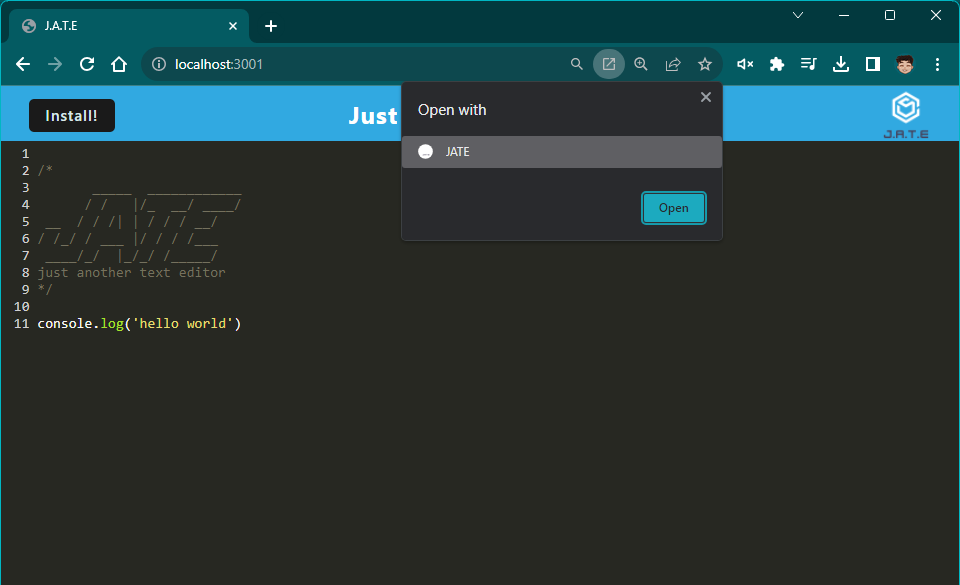
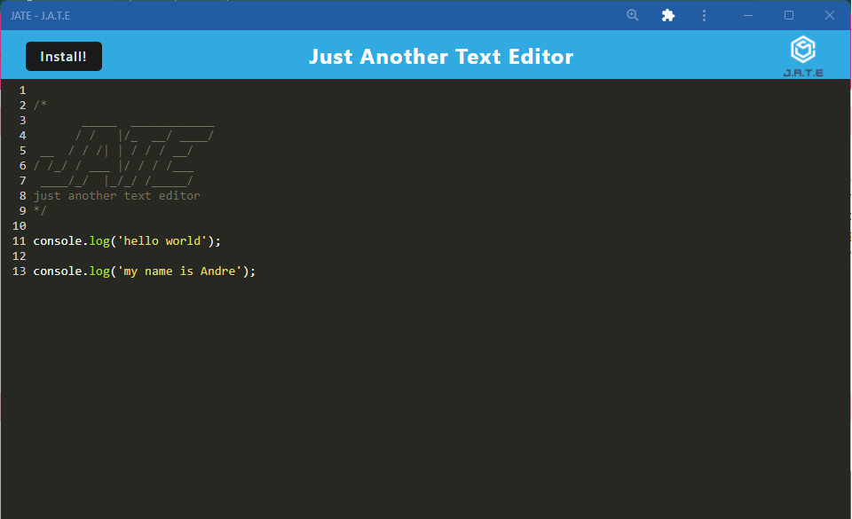

# Text Editor

## Description
This project is a single-page text editor web application that allows you to create, edit, and store notes or code snippets. It's designed to work both online and offline, ensuring that your data is always accessible, even when you don't have an internet connection. This text editor also meets the criteria of a Progressive Web App (PWA) and leverages modern web technologies for a seamless user experience.

## Technologies

- JavaScript: ES6+ for the application's logic.
- Express.js: For serving the application on the server.
- Webpack: For bundling JavaScript files.
- Workbox: For service worker and PWA functionality.
- IndexedDB: For local data storage.
- HTML: For structuring the web application.
- CSS: For styling the user interface.

## Screenshots
The following screenshots follow the path of the preview video above, so you can take a closer look at the routes.

## Link to GitHub Repository:

[https://github.com/ademonteverde/pwa_text_editor](hhttps://github.com/ademonteverde/pwa_text_editor)

## Link to application:

[https://shrouded-badlands-70593-5d90e2e2209f.herokuapp.com/](https://shrouded-badlands-70593-5d90e2e2209f.herokuapp.com/)

## License

This project is licensed under the [MIT](https://github.com/ademonteverde/pwa_text_editor/blob/main/LICENSE) License.